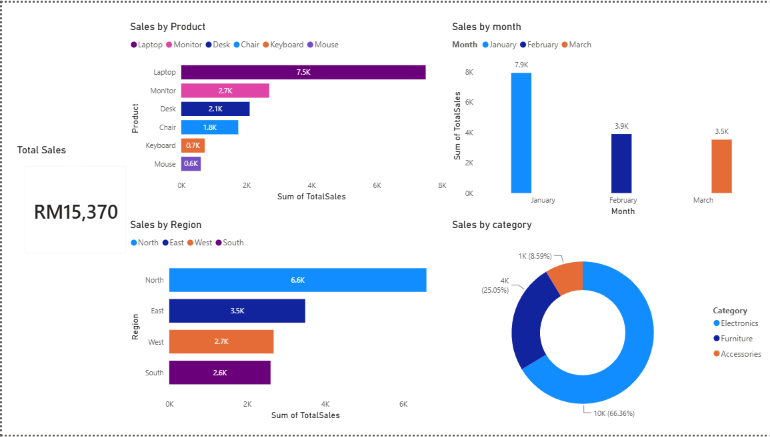

## Dashboard Preview

# Sales Data Analysis

This is a beginner data analytics portfolio project using SQL, Power BI, and Python.

## Project Goal
The goal of this project is to analyze sales data and create useful business insights.

## Tools Used
- SQL
- Power BI
- Python
- Excel
- GitHub

## Questions To Answer
- What are the total sales?
- Which products sell the most?
- Which months have the highest sales?
- Which region performs best?
- What business recommendations can be made from the data?

## Project Structure
- `data/` - dataset files
- `sql/` - SQL queries
- `python/` - Python analysis and cleaning
- `powerbi/` - Power BI dashboard file
- `images/` - dashboard screenshots

## Project Progress
- Dataset added
- SQL analysis queries added
- Python analysis script added
- Power BI dashboard added
- Dashboard screenshot added

## Key Insights
- Total sales were RM15,370.
- Laptop had the highest sales at RM7,500.
- North was the top-performing region with RM6,600 in sales.
- Electronics was the strongest category, contributing the largest share of sales.
- January had the highest monthly sales.

## Business Recommendations
- Focus marketing efforts on laptops because they generated the highest sales.
- Review performance in the South region and identify ways to improve sales.
- Keep electronics products well-stocked because they are the strongest category.
- Study January promotions or customer behavior to understand why sales were highest.

## Next Steps
- Create a Power BI dashboard
- Add dashboard screenshots
- Write final business recommendations
